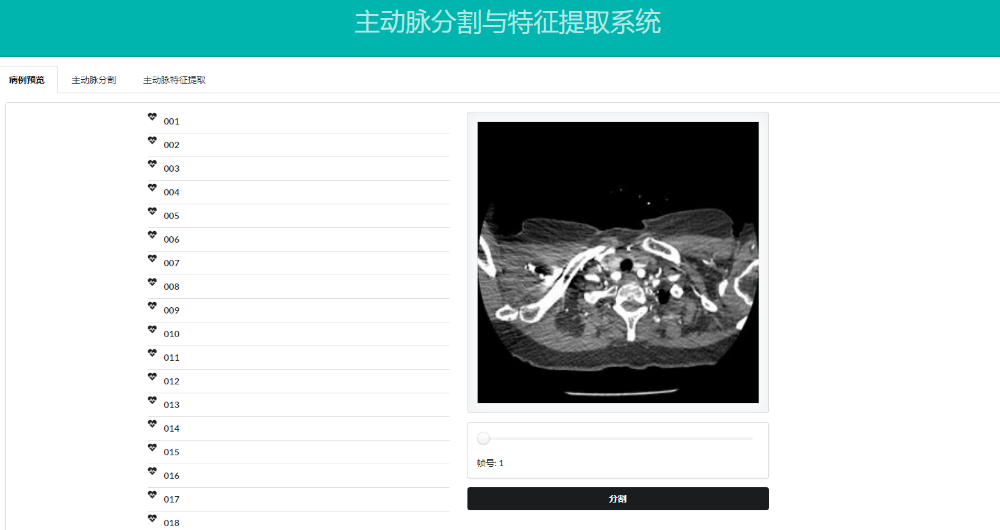
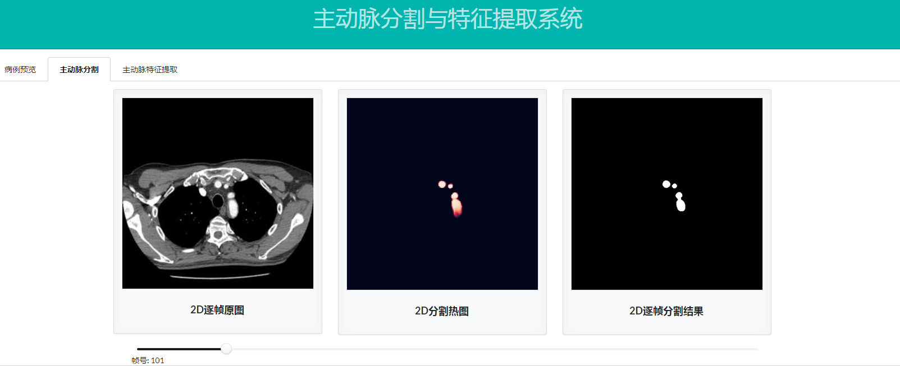
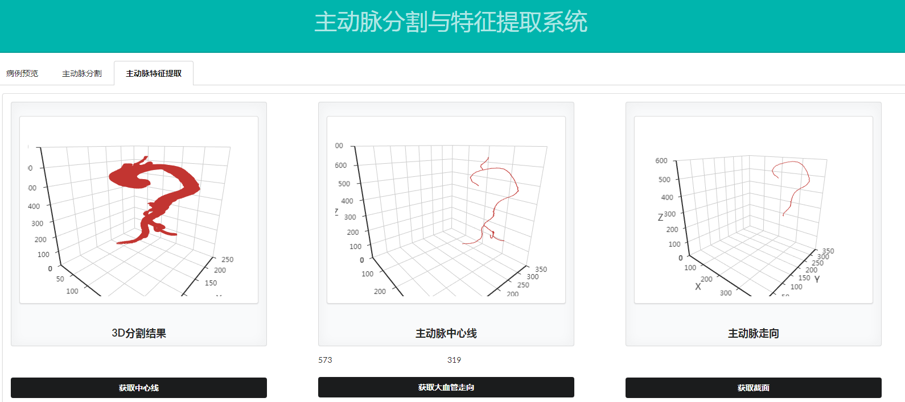
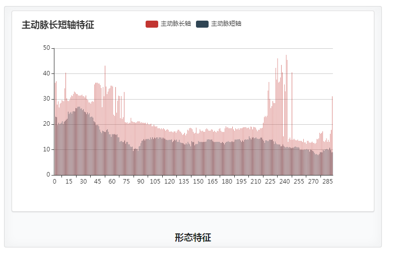
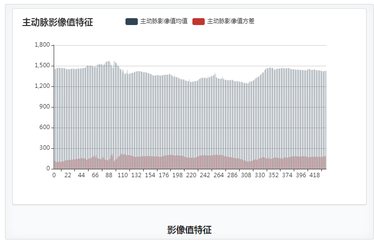

# 主动脉分割与特征提取系统页面展示部分代码

**主动脉病例预览模块**

该部分是主动脉病例预览模块的效果，包括分页显示病例，点击病例后可以显示对应的病例CT的第一帧，并在拖动进度条的时候对该病例的CT的所有数据实现预览。

**主动脉分割展示模块**

显示三个部分的内容，分别是主动脉CTA原图像帧，对应帧的分割热图，最终判断的结果

**主动脉特征提取模块**

该图是主动脉分割后的3D的体数据和对应中心线提取结果和主动脉的走向的获取。

该图是主动脉的形态特征即长短轴长度的统计

该图是主动脉的影像值特征即像素均值方差的统计

